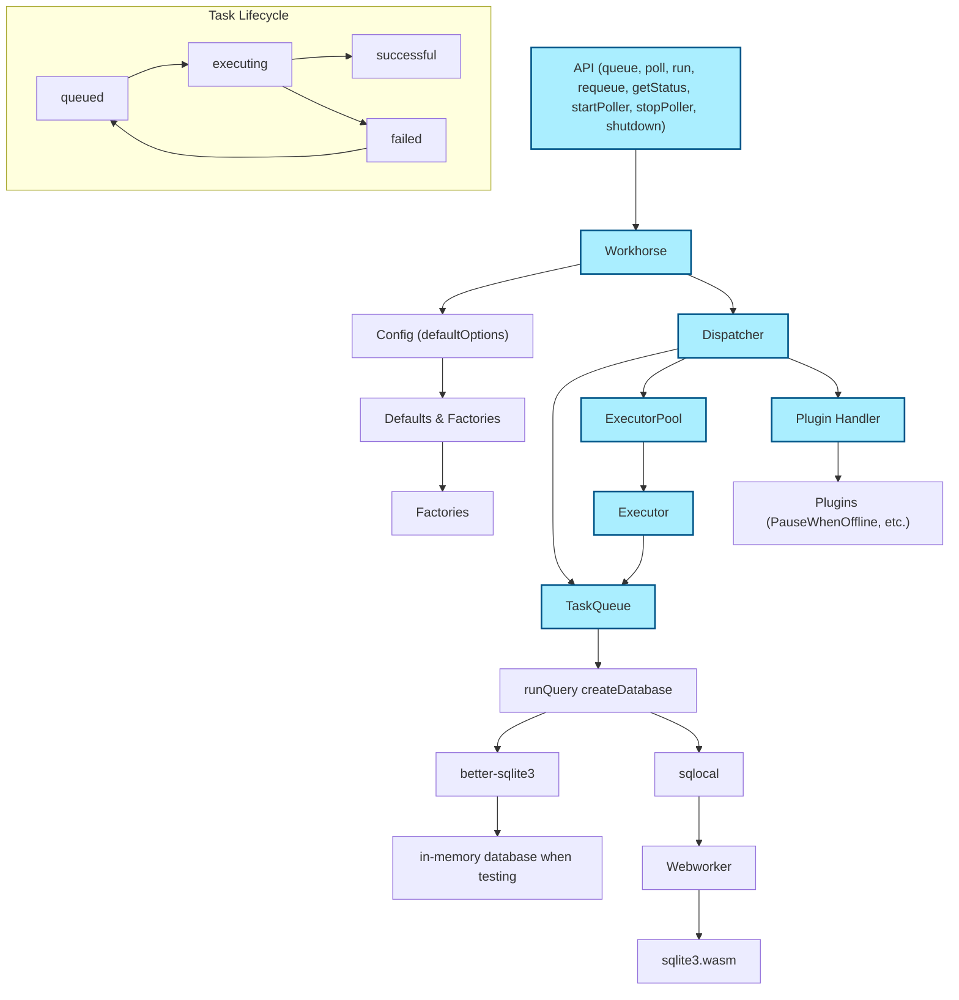

# workhorse
# [try it out](https://hyrfilm.github.io/workhorse)

## persistent task queue for the browser
Depending on your use-case can be configured with various forms of guarentees:
* once-and-only-once execution
* guaranteed ordering
* transactional (full ACID-support)
* Fully in-memory taskquees or using the high performance file system (OPFS)
* extensively property / fuzz testing in regards to concurrency (deadlocks, race-conditions etc)
* performance: tested with a concurrency settings up a setting of 1000 consumers (eg a 1000 simulatanous uploads/downloads)
* observability
* extensibility in terms of plugins

Implemented using SQLite running in webworkers.

## brief overview

